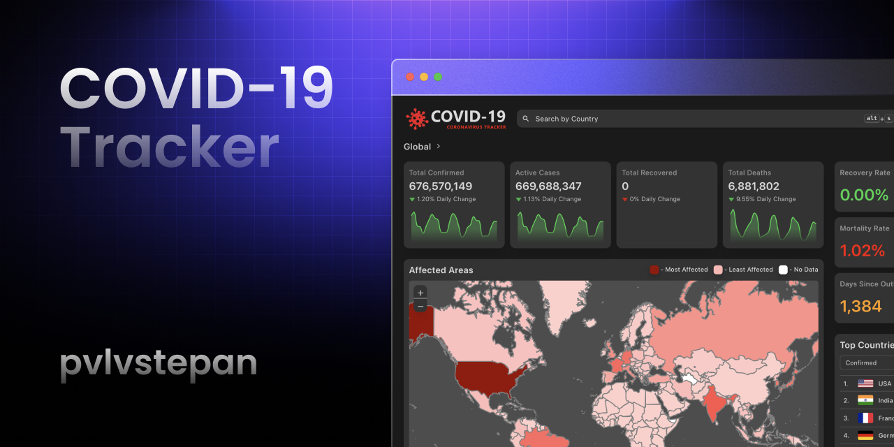

# COVID-19 Tracker



[](https://github.com/covid-19-tracker/movie-lister/actions/workflows/pages/pages-build-deployment)

COVID-19 Tracker: a web application that provides real-time information on the COVID-19 pandemic. It offers data on the number of confirmed cases, recoveries, and fatalities, along with detailed statistics for different countries and regions.

Features

- View global statistics for COVID-19, including total cases, recoveries, and deaths.
- Search for country-specific data.
- Interactive map to visualize the spread of the virus.
- Historical data and trend charts.

## Installation

To run COVID-19 Tracker locally, follow these steps:

1. Clone the repository:

   ```bash
   git clone https://github.com/pvlvstepan/covid-19-tracker.git
   cd covid-19-tracker
   ```

2. Install dependencies (Node.js v12 or higher, but not higher than v16 is required):

   ```bash
   npm install
   ```

3. Start the development server:

   ```bash
   npm start
   ```

4. Open your web browser and navigate to `http://localhost:3000` to access the application.


## Technologies Used

- [React](https://react.dev/)
- [Axios](https://github.com/axios/axios)
- [Leaflet](https://leafletjs.com/)
- [Chart.js](https://www.chartjs.org/)
- [chakra-ui](https://chakra-ui.com/)
- [disease.sh API](https://disease.sh)

## License

This project is licensed under the MIT License - see the [LICENSE](LICENSE) file for details.

## Acknowledgments

- Special thanks to the creators of the [disease.sh](https://disease.sh) API
